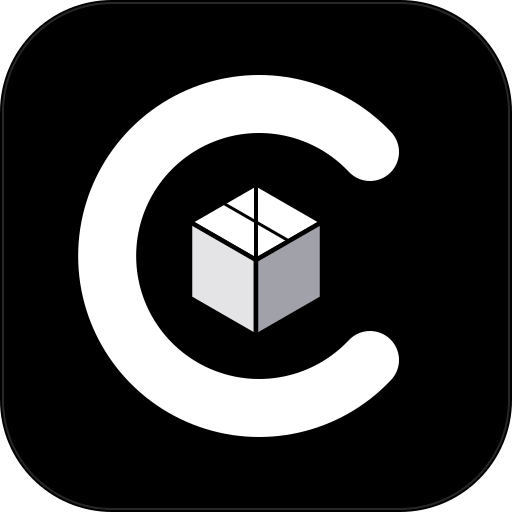

<div align="center">

#  Castor

**A lightweight, content-addressed, distributed S3-compatible object storage system built in Go.**

[Overview](#overview) • [Architecture](#architecture) • [Key Features](#key-features) • [Quickstart](#quickstart) • [S3 API & CLI](#s3-api--cli-usage) • [Configuration](#configuration) • [Testing](#testing)

---

</div>

## 📖 Overview

**Castor** is a modern distributed object storage engine engineered from the ground up for strict consistency, modularity, and operational simplicity. Instead of treating storage as an opaque black box, Castor decouples the system into three specialized tiers:

1. **Stateless S3 Gateway (`gateway-svc`)**: Embedded [VersityGW](https://github.com/versity/versitygw) providing native AWS S3 REST compatibility (SigV4, Path-style), backed by streaming 4MiB chunking, in-memory zero-copy buffer pools (`sync.Pool`), and quorum replication coordinators.
2. **Metadata Consensus Cluster (`metadata-svc`)**: Multi-node [HashiCorp Raft](https://github.com/hashicorp/raft) consensus engine backed by BadgerDB LSM state machines for atomic manifest commits, strong consistency, and dynamic node heartbeats.
3. **Stateless Chunk Storage Nodes (`data-svc`)**: High-throughput Content-Addressed Storage (CAS) nodes managing immutable 4MiB chunks sharded by SHA-256 with two-phase atomic promotions (`/staging/*.tmp` $\to$ `/chunks/xx/<hash>`).

---

## 🏛️ Architecture

```text
                     ┌───────────────────────────────────┐
                     │ Clients (AWS CLI / SDKs / Probes) │
                     └─────────────────┬─────────────────┘
                                       │
                          HTTP :9000   │   HTTP :9001
                        (S3 REST API)  │  (Health /telemetry)
                                       ▼
  ┌────────────────────────────────────────────────────────────────────────┐
  │                  gateway-svc (Stateless Ingress Tier)                  │
  │  - Embedded versitygw (SigV4)        - sync.Pool Buffer Pooling        │
  │  - 4MiB Streaming Chunking (CAS)     - Quorum Placement (W=2, R=3)     │
  │  - Fiber v3 Health / Telemetry       - Dynamic Raft Leader Routing     │
  └──────────────────┬──────────────────────────────────────┬──────────────┘
                     │                                      │
    gRPC Metadata    │                                      │ gRPC Data Stream
    (Manifest/Bucket)│                                      │ (Put/GetChunk W=2)
                     ▼                                      ▼
  ┌────────────────────────────────────┐  ┌────────────────────────────────┐
  │            metadata-svc            │  │            data-svc            │
  │      (3-Node Raft Consensus)       │  │  (Stateless Content-Addressed) │
  │                                    │  │                                │
  │  ┌──────────────────────────────┐  │  │  ┌──────────────────────────┐  │
  │  │ Node 1 (Raft Leader :9090)   │  │  │  │ Node 1 (:9101)           │  │
  │  │ - BadgerDB LSM State Machine │  │  │  │ - /data/chunks/xx/<sha>  │  │
  │  │ - Atomic CommitManifest      │  │  │  │ - Staging -> fsync       │  │
  │  └──────────────┬───────────────┘  │  │  └──────────────────────────┘  │
  │        Raft Log │ Replication      │  │  ┌──────────────────────────┐  │
  │                 ▼                  │  │  │ Node 2 (:9102)           │  │
  │  ┌──────────────────────────────┐  │  │  │ - /data/chunks/xx/<sha>  │  │
  │  │ Nodes 2 & 3 (Followers)      │  │  │  └──────────────────────────┘  │
  │  │ - Replicated BadgerDB FSM    │  │  │  ┌──────────────────────────┐  │
  │  └──────────────────────────────┘  │  │  │ Node 3 (:9103)           │  │
  │                                    │  │  │ - /data/chunks/xx/<sha>  │  │
  │  - Heartbeat Node Registry ◄───────┼──┼──┤ - 3s Capacity Heartbeat  │  │
  │                                    │  │  └──────────────────────────┘  │
  └────────────────────────────────────┘  └────────────────────────────────┘
```

---

## ✨ Key Features

- **⚡ Native Amazon S3 Compatibility**: Implements the AWS S3 REST specification using embedded VersityGW. Works out of the box with `aws-cli`, AWS SDK Go v2, Python `boto3`, MinIO Client (`mc`), and Rclone.
- **🧩 Content-Addressed Storage (CAS)**:
  - Fixed 4MiB chunking invariant (`4 << 20`) with inline SHA-256 computation.
  - Zero-copy buffer pools (`sync.Pool`) protect gateway memory against OOM spikes under high concurrent throughput.
  - Deduplication: Identical payload chunks share disk space and require zero redundant writes.
- **🛡️ Distributed Raft Consensus**:
  - Metadata tier is governed by HashiCorp Raft with persistent BoltDB WAL logs and BadgerDB state machines.
  - Strict serializability for bucket lifecycles and object manifests.
  - Dynamic leader failover: Gateway automatically detects leader changes and transparently reroutes RPCs.
- **⚖️ Quorum Placement & Resilience**:
  - $W=2$ write quorum over 3 storage nodes guarantees durability even if a storage node is offline.
  - Read failover: Gateway streams chunk reads from healthy replicas on node timeouts or missing blocks.
- **📂 Advanced S3 Capabilities**:
  - **`ListObjectsV2` & `ListObjects`**: Full support for `prefix` and `delimiter` (`/`) hierarchies, folder simulation, and continuation tokens (`PrefixNext` upper-bound iteration).
  - **Range Queries (`206 Partial Content`)**: Byte-range requests across single and multi-chunk boundaries with minimal memory allocation.
  - **Idempotent Deletions**: Full S3-compliant deletion semantics for buckets and objects.

---

## 🚀 Quickstart

Run a full 7-node distributed Castor cluster locally in 30 seconds using Docker Compose.

### 1. Prerequisites
- [Docker Engine](https://docs.docker.com/engine/) (v24.0+) & Docker Compose
- [AWS CLI v2](https://docs.aws.amazon.com/cli/latest/userguide/install-cliv2.html) (or `curl`)

### 2. Launch Cluster

```bash
# Clone the repository
git clone https://github.com/tharunn0/castor.git
cd castor

# Start 1 Gateway, 3 Metadata Raft nodes, and 3 Data nodes
docker compose up -d
```

Check cluster container health:
```bash
docker compose ps
```

Verify the gateway health endpoint:
```bash
curl http://localhost:9001/health
# {"status":"ok","time":"2026-10-07T..."}
```

---

## 💻 S3 API & CLI Usage

Configure AWS CLI to point to Castor on port `9000` with the default root credentials (`admin` / `admin123`):

```bash
export AWS_ACCESS_KEY_ID=admin
export AWS_SECRET_ACCESS_KEY=admin123
export AWS_DEFAULT_REGION=us-east-1
CASTOR="aws --endpoint-url http://localhost:9000"
```

### Create Bucket
```bash
$CASTOR s3 mb s3://photos
# make_bucket: photos
```

### Upload Objects
```bash
# Upload a single file
$CASTOR s3 cp testfile.mp4 s3://photos/testfile.mp4

# Upload a directory
$CASTOR s3 sync ./assets s3://photos/assets/
```

### List Buckets & Hierarchy
```bash
# List all buckets
$CASTOR s3 ls

# List objects with folder simulation
$CASTOR s3 ls s3://photos/ --recursive
```

### Download & Range Requests
```bash
# Download file
$CASTOR s3 cp s3://photos/testfile.mp4 ./downloaded.mp4

# Range request (first 1024 bytes) via curl
curl -H "Range: bytes=0-1023" http://localhost:9000/photos/testfile.mp4 -o partial.bin
```

### Delete Objects & Bucket
```bash
# Delete object
$CASTOR s3 rm s3://photos/testfile.mp4

# Remove bucket
$CASTOR s3 rb s3://photos
```

---

## ⚙️ Configuration

Castor services are configured through environment variables:

### `gateway-svc`
| Variable | Description | Default |
|:---|:---|:---|
| `S3_ADDR` | Listen address for S3 REST API (VersityGW) | `:9000` |
| `CONSOLE_ADDR` | Listen address for Health / Fiber API | `:9001` |
| `METADATA_NODES` | Comma-separated list of `metadata-svc` gRPC endpoints | `localhost:9090` |
| `DATA_NODES` | Comma-separated list of `data-svc` gRPC endpoints | `localhost:9101,localhost:9102,localhost:9103` |
| `WRITE_QUORUM` | Required chunk replica acks for write success | `2` |
| `CHUNK_SIZE` | Chunk size in bytes (Invariant: 4MiB) | `4194304` |
| `ROOT_ACCESS_KEY_ID` | Bootstrap root S3 Access Key ID | `admin` |
| `ROOT_SECRET_ACCESS_KEY` | Bootstrap root S3 Secret Access Key | `admin123` |

### `metadata-svc`
| Variable | Description | Default |
|:---|:---|:---|
| `NODE_ID` | Unique node identifier in Raft cluster | `metadata-1` |
| `GRPC_ADDR` | Listen address for gRPC client connections | `:9090` |
| `RAFT_ADDR` | Listen address for Raft peer consensus | `:9091` |
| `RAFT_PEERS` | Comma-separated map of Raft peers (`id=host:port`) | `""` |
| `RAFT_BOOTSTRAP` | Initial cluster bootstrap trigger | `false` |
| `DATA_DIR` | Local disk root for Raft WAL and BadgerDB | `/data` |

### `data-svc`
| Variable | Description | Default |
|:---|:---|:---|
| `NODE_ID` | Storage node identifier | `data-1` |
| `GRPC_ADDR` | Listen address for chunk upload/download gRPC | `:9101` |
| `DATA_DIR` | Root filesystem path for staging and chunks | `/data` |

---

## 🧪 Testing

Castor includes a battle-tested test suite with unit, race-condition, and live multi-chunk integration suites.

```bash
# Run unit tests across all packages
make test

# Run tests with the Go race detector enabled
make test-race

# Run end-to-end multi-chunk HTTP integration tests
make test-integration

# Run entire test suite (unit + integration)
make test-full
```

> **Note on Chunk Invariant**: The default system chunk size is 4MiB (`4 << 20`). Multi-chunk integration tests dynamically generate payloads strictly $> 4\text{MiB}$ to verify streaming boundaries and quorum placement.

---

## 🗂️ Project Structure

```
castor/
├── cmd/
│   ├── gateway-svc/       # S3 REST gateway & Fiber health server entrypoint
│   ├── metadata-svc/      # Raft consensus & BadgerDB metadata daemon
│   └── data-svc/          # CAS chunk storage daemon
├── internal/
│   ├── gateway/
│   │   ├── backend/       # VersityGW S3 backend adapter (CRUD, listing, ranges)
│   │   ├── storage/       # Multi-chunking engine, quorum placement, buffer pools
│   │   ├── health/        # Fiber v3 health & telemetry routes
│   │   └── config/        # Gateway runtime configuration
│   ├── metadata/
│   │   ├── consensus/     # HashiCorp Raft integration & FSM
│   │   ├── store/         # BadgerDB atomic manifest & bucket storage
│   │   ├── registry/      # In-memory heartbeat node registry
│   │   └── server/        # gRPC MetadataService implementation
│   ├── data/
│   │   ├── storage/       # Staging filesystem CAS engine & fsync rename
│   │   └── server/        # gRPC DataService streaming chunk endpoints
│   └── telemetry/         # Structured slog logger & tracing helpers
├── tests/
│   └── integration/       # Live HTTP integration tests (AWS SDK Go v2)
├── docs/                  # In-depth architectural & milestone design docs
├── docker-compose.yml     # Turnkey 7-node local cluster orchestration
└── Dockerfile             # Multi-stage distroless build file
```

---

## 📄 License

Castor is open-source software licensed under the [Apache License 2.0](LICENSE).
