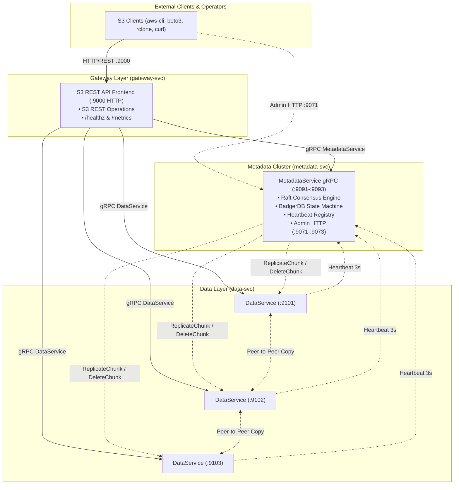

# Castor — Unified API Specification

This document serves as the comprehensive and definitive API reference for Castor. It details the **External Client API** (S3-compatible REST) and the **Internal Cluster APIs** (Metadata and Data Service gRPC).

---

## 1. System API Architecture & Topology

Castor exposes two tiers of interfaces:
1. **External API (Clients & Operators)**:
   - **S3-Compatible HTTP/REST API** (`:9000` on `gateway-svc`): Full compatibility with AWS CLI, AWS SDKs (`boto3`, `@aws-sdk/client-s3`), and S3 tools (`rclone`). Also serves `/healthz` and `/metrics`.
2. **Internal Cluster APIs (Inter-Service gRPC & Admin HTTP)**:
   - **Metadata Service gRPC API (`MetadataService`)** (`:9091`-`:9093` on `metadata-svc`): Raft-replicated metadata operations, dynamic node heartbeats, and lifecycle hooks. Accompanied by admin HTTP endpoints (`:9071`-`:9073`).
   - **Storage Node Data Service gRPC API (`DataService`)** (`:9101`-`:9103` on `data-svc`): Streaming chunk ingestion, retrieval, peer replication, and garbage collection.



---

## 2. Common Protocols & Cross-Cutting Conventions

### 2.1. Port Allocation Matrix
| Service | Component | Protocol | Default Port(s) | Description |
|---|---|---|---|---|
| `gateway-svc` | S3 Frontend & Health | HTTP / REST | `:9000` | S3-compatible REST endpoint, `/healthz`, `/metrics` |
| `metadata-svc`| `MetadataService` | gRPC / HTTP2 | `:9091`, `:9092`, `:9093` | Inter-service metadata & heartbeat API |
| `metadata-svc`| Admin & Metrics | HTTP / REST | `:9071`, `:9072`, `:9073` | Operator inspection (`/admin/*`), `/metrics` |
| `metadata-svc`| Raft Consensus | TCP | `:9081`, `:9082`, `:9083` | Internal peer Raft consensus transport |
| `data-svc`    | `DataService` | gRPC / HTTP2 | `:9101`, `:9102`, `:9103` | Raw chunk storage, streaming & P2P copy |

### 2.2. gRPC Envelope Framing & Size Limits
Standard Go gRPC defaults to a 4MB `MaxRecvMsgSize`, which causes `ResourceExhausted` errors when handling 4MB chunks bundled with Protobuf framing overhead.
- All Castor gRPC clients and servers enforce **`MaxRecvMsgSize = 16MB`** and **`MaxSendMsgSize = 16MB`** (`16 * 1024 * 1024` bytes).
- Streaming operations (`Put`, `Get`, `PutChunk`, `UploadPart`) utilize a **two-phase streaming envelope pattern**:
  1. The **initial message frame** delivers control metadata (such as bucket name, object key, or expected SHA-256 hash).
  2. **Subsequent message frames** stream pure byte payload slices (typically 64KB to 1MB, up to the full 4MB chunk).

### 2.3. Error Code Mapping
Internal gRPC status codes map directly to HTTP/S3 REST responses:

| gRPC Status Code | HTTP Status Code | S3 Error Code | Description |
|---|---|---|---|
| `OK` (0) | `200 OK` | — | Operation succeeded |
| `INVALID_ARGUMENT` (3) | `400 Bad Request` | `InvalidArgument` | Malformed key, invalid chunk hash, or unsupported header |
| `NOT_FOUND` (5) | `404 Not Found` | `NoSuchKey` / `NoSuchBucket` | Bucket or key does not exist |
| `ALREADY_EXISTS` (6) | `409 Conflict` | `BucketAlreadyOwnedByYou` | Bucket already exists |
| `RESOURCE_EXHAUSTED` (8) | `507 Insufficient Storage`| `SlowDown` / `QuotaExceeded` | Storage node disk is full or buffer semaphore saturated |
| `FAILED_PRECONDITION` (9)| `412 Precondition Failed`| `PreconditionFailed` | ETag or version precondition match failure |
| `UNAVAILABLE` (14) | `503 Service Unavailable` | `ServiceUnavailable` | Quorum could not be reached ($W < 2$) or Raft electing |

---

## 3. External S3 REST API Reference (`gateway-svc :9000`)

The S3 REST API conforms to the Amazon S3 REST protocol using **Path-Style** addressing (`http://<host>:9000/<bucket>/<key>`).

> [!IMPORTANT]
> **No Manual HTTP/XML Plumbing**: All S3 wire-level mechanics—including HTTP request parsing, AWS SigV4 signature authentication, `aws-chunked` decoding, and bidirectional XML serialization/deserialization—are managed entirely by an embedded instance of **`versitygw`** (`github.com/versity/versitygw`). Castor implements the `versitygw.Backend` Go interface, directly bridging standard S3 actions into Castor's streaming chunking, deduplication, and quorum placement pipeline.

### 3.1. S3 Protocol Engine (`versitygw`)
- **Signature Version 4 (SigV4)**: Validated automatically by `versitygw` using `AWS4-HMAC-SHA256` against cluster credentials (`access_key_id` / `secret_access_key`).
- **Unsigned Payloads**: Supported transparently for unsigned requests (`x-amz-content-sha256: UNSIGNED-PAYLOAD` or `--no-sign-request`).
- **XML Marshaling / Unmarshaling**: `versitygw` serializes all XML response documents (`<ListBucketResult>`, `<ListAllMyBucketsResult>`, `<CompleteMultipartUploadResult>`, `<Error>`) and deserializes incoming XML payloads (`<CompleteMultipartUpload>`), eliminating manual XML parsing code in Castor.
- **Streaming AWS Chunked**: Decoded on the fly by `versitygw` into a standard, clean `io.Reader` stream passed to Castor's chunking engine.

### 3.2. S3 Endpoint Catalog

#### Service Level Operations

##### `GET /` — ListBuckets
Returns a list of all buckets in the cluster.
- **Request**: `GET / HTTP/1.1`
- **Response**: `HTTP/1.1 200 OK`, `Content-Type: application/xml`
```xml
<?xml version="1.0" encoding="UTF-8"?>
<ListAllMyBucketsResult xmlns="http://s3.amazonaws.com/doc/2006-03-01/">
    <Owner>
        <ID>castor</ID>
        <DisplayName>castor</DisplayName>
    </Owner>
    <Buckets>
        <Bucket>
            <Name>backups</Name>
            <CreationDate>2026-09-18T08:30:00.000Z</CreationDate>
        </Bucket>
        <Bucket>
            <Name>media</Name>
            <CreationDate>2026-09-18T09:15:00.000Z</CreationDate>
        </Bucket>
    </Buckets>
</ListAllMyBucketsResult>
```

---

#### Bucket Level Operations

##### `PUT /<bucket>` — CreateBucket
Creates a new top-level bucket namespace.
- **Request**: `PUT /media HTTP/1.1`
- **Response**: `HTTP/1.1 200 OK`, `Location: /media`

##### `DELETE /<bucket>` — DeleteBucket
Deletes an empty bucket.
- **Request**: `DELETE /media HTTP/1.1`
- **Response**: `HTTP/1.1 204 No Content`
- **Error (Bucket Not Empty)**: `HTTP/1.1 409 Conflict`, `Code: BucketNotEmpty`

##### `HEAD /<bucket>` — HeadBucket
Checks if a bucket exists and caller has access.
- **Request**: `HEAD /media HTTP/1.1`
- **Response**: `HTTP/1.1 200 OK` (or `404 Not Found`)

---

#### Object Level Operations

##### `PUT /<bucket>/<key>` — PutObject
Streams and persists an entire object.
- **Request**:
  ```http
  PUT /media/videos/sample.mp4 HTTP/1.1
  Host: localhost:9000
  Content-Length: 10485760
  Content-Type: video/mp4
  Authorization: AWS4-HMAC-SHA256 Credential=...
  ```
- **Response**:
  ```http
  HTTP/1.1 200 OK
  ETag: "7f83b1657ff1fc53b92dc18148a1d65dfc2d4b1fa3d677284addd200126d9069"
  Content-Length: 0
  ```

##### `GET /<bucket>/<key>` — GetObject
Retrieves object contents. Supports HTTP range requests.
- **Request**:
  ```http
  GET /media/videos/sample.mp4 HTTP/1.1
  Host: localhost:9000
  Range: bytes=0-4194303
  ```
- **Response**:
  ```http
  HTTP/1.1 206 Partial Content
  Content-Type: video/mp4
  Content-Length: 4194304
  Content-Range: bytes 0-4194303/10485760
  ETag: "7f83b1657ff1fc53b92dc18148a1d65dfc2d4b1fa3d677284addd200126d9069"

  <raw binary chunk bytes>
  ```

##### `HEAD /<bucket>/<key>` — HeadObject
Retrieves object metadata without returning the payload body.
- **Request**: `HEAD /media/videos/sample.mp4 HTTP/1.1`
- **Response**:
  ```http
  HTTP/1.1 200 OK
  Content-Length: 10485760
  Content-Type: video/mp4
  ETag: "7f83b1657ff1fc53b92dc18148a1d65dfc2d4b1fa3d677284addd200126d9069"
  Last-Modified: Fri, 18 Sep 2026 09:30:00 GMT
  ```

##### `DELETE /<bucket>/<key>` — DeleteObject
Deletes an object manifest (marks tombstone and decrements chunk reference counts).
- **Request**: `DELETE /media/videos/sample.mp4 HTTP/1.1`
- **Response**: `HTTP/1.1 204 No Content`

##### `GET /<bucket>?list-type=2` — ListObjectsV2
Lists object keys inside a bucket with optional prefix and delimiter hierarchy.
- **Query Parameters**:
  - `list-type=2` (required)
  - `prefix`: Filter keys matching this prefix
  - `delimiter`: Group sub-keys into `CommonPrefixes` (e.g. `/`)
  - `max-keys`: Maximum objects to return (default 1000)
  - `start-after`: Key to start listing after
  - `continuation-token`: Pagination cursor
- **Response**: `HTTP/1.1 200 OK`, `Content-Type: application/xml`
```xml
<?xml version="1.0" encoding="UTF-8"?>
<ListBucketResult xmlns="http://s3.amazonaws.com/doc/2006-03-01/">
    <Name>media</Name>
    <Prefix>videos/</Prefix>
    <KeyCount>1</KeyCount>
    <MaxKeys>1000</MaxKeys>
    <IsTruncated>false</IsTruncated>
    <Contents>
        <Key>videos/sample.mp4</Key>
        <LastModified>2026-09-18T09:30:00.000Z</LastModified>
        <ETag>"7f83b1657ff1fc53b92dc18148a1d65dfc2d4b1fa3d677284addd200126d9069"</ETag>
        <Size>10485760</Size>
        <StorageClass>STANDARD</StorageClass>
    </Contents>
</ListBucketResult>
```

---

#### Multipart Upload Operations

##### `POST /<bucket>/<key>?uploads` — InitiateMultipartUpload
Starts a multipart upload session and issues a unique `UploadId`.
- **Request**: `POST /media/large.iso?uploads HTTP/1.1`
- **Response**:
```xml
<?xml version="1.0" encoding="UTF-8"?>
<InitiateMultipartUploadResult xmlns="http://s3.amazonaws.com/doc/2006-03-01/">
    <Bucket>media</Bucket>
    <Key>large.iso</Key>
    <UploadId>c83b40d2-9721-4f9e-a0e4-b78901234567</UploadId>
</InitiateMultipartUploadResult>
```

##### `PUT /<bucket>/<key>?uploadId=X&partNumber=N` — UploadPart
Uploads an individual part.
- **Request**:
  ```http
  PUT /media/large.iso?uploadId=c83b40d2-9721-4f9e-a0e4-b78901234567&partNumber=1 HTTP/1.1
  Content-Length: 5242880
  ```
- **Response**:
  ```http
  HTTP/1.1 200 OK
  ETag: "e3b0c44298fc1c149afbf4c8996fb92427ae41e4649b934ca495991b7852b855"
  ```

##### `POST /<bucket>/<key>?uploadId=X` — CompleteMultipartUpload
Finalizes the upload by concatenating parts into a single manifest.
- **Request**:
```xml
<CompleteMultipartUpload xmlns="http://s3.amazonaws.com/doc/2006-03-01/">
    <Part>
        <PartNumber>1</PartNumber>
        <ETag>"e3b0c44298fc1c149afbf4c8996fb92427ae41e4649b934ca495991b7852b855"</ETag>
    </Part>
    <Part>
        <PartNumber>2</PartNumber>
        <ETag>"8743b52063cd84097a65d1633f5c74f5"</ETag>
    </Part>
</CompleteMultipartUpload>
```
- **Response**:
```xml
<CompleteMultipartUploadResult xmlns="http://s3.amazonaws.com/doc/2006-03-01/">
    <Location>/media/large.iso</Location>
    <Bucket>media</Bucket>
    <Key>large.iso</Key>
    <ETag>"bf8b456a00cd4208a7123ef987654321-2"</ETag>
</CompleteMultipartUploadResult>
```

##### `DELETE /<bucket>/<key>?uploadId=X` — AbortMultipartUpload
Cancels the multipart session, decrements chunk refcounts, and discards uncommitted parts.
- **Request**: `DELETE /media/large.iso?uploadId=c83b40d2-9721-4f9e-a0e4-b78901234567 HTTP/1.1`
- **Response**: `HTTP/1.1 204 No Content`

---

## 4. Operator & Admin HTTP API

Castor provides standard REST/HTTP endpoints for health monitoring, Prometheus telemetry, and administrative operations:

### 4.1. Gateway Service Endpoints (`:9000`)
- `GET /healthz`: Basic readiness/liveness check. Returns `200 OK` if the gateway is running and connected to the metadata cluster.
- `GET /metrics`: Standard Prometheus metrics format exposing request rates, chunk transfer latency, buffer pool allocations, and error counters.

### 4.2. Metadata Cluster Admin Endpoints (`:9071`-`:9073`)
Exposed directly by `metadata-svc` nodes (with the active leader handling state transitions):
- `GET /healthz`: Returns node Raft status (`LEADER`, `FOLLOWER`, or `CANDIDATE`).
- `GET /metrics`: Raft performance metrics, BadgerDB LSM stats, active node counts, and worker run histories.
- `GET /admin/raft/status`: Returns JSON detailing current term, active leader address, and peer commit indices.
- `GET /admin/nodes`: Returns JSON array of storage nodes registered in the dynamic heartbeat registry, their health states (`HEALTHY`, `DEGRADED`, `OFFLINE`), and disk capacities.
- `POST /admin/gc`: Triggers an immediate garbage collection sweep on the Raft leader. Accepts query parameter `?dry_run=true` to report reclaimable chunks without deleting them.

---

## 5. Internal Metadata gRPC API (`MetadataService` :9091-:9093)

Defined in `proto/castor/v1/metadata.proto`. Invoked by `gateway-svc` and storage nodes to interact with the Raft consensus cluster.

```protobuf
syntax = "proto3";

package castor.v1;

option go_package = "github.com/castor/proto/castor/v1;castorv1";

import "google/protobuf/timestamp.proto";

service MetadataService {
  // Bucket management (Raft replicated)
  rpc CreateBucket(CreateBucketMetadataRequest) returns (CreateBucketMetadataResponse);
  rpc DeleteBucket(DeleteBucketMetadataRequest) returns (DeleteBucketMetadataResponse);
  rpc ListBuckets(ListBucketsMetadataRequest) returns (ListBucketsMetadataResponse);
  rpc CheckBucketExists(CheckBucketExistsRequest) returns (CheckBucketExistsResponse);

  // Manifest & Chunk operations (Raft replicated)
  rpc CheckChunks(CheckChunksRequest) returns (CheckChunksResponse);
  rpc CommitManifest(CommitManifestRequest) returns (CommitManifestResponse);
  rpc GetManifest(GetManifestRequest) returns (GetManifestResponse);
  rpc DeleteManifest(DeleteManifestRequest) returns (DeleteManifestResponse);
  rpc ListManifests(ListManifestsRequest) returns (ListManifestsResponse);

  // Multipart uploads (Raft replicated)
  rpc InitiateMultipart(InitiateMultipartMetaRequest) returns (InitiateMultipartMetaResponse);
  rpc CommitPart(CommitPartMetaRequest) returns (CommitPartMetaResponse);
  rpc CompleteMultipart(CompleteMultipartMetaRequest) returns (CommitManifestResponse);
  rpc AbortMultipart(AbortMultipartMetaRequest) returns (AbortMultipartMetaResponse);

  // Dynamic Heartbeat Registry (Ephemeral, in-memory, bypasses Raft)
  rpc RegisterNode(RegisterNodeRequest) returns (RegisterNodeResponse);
  rpc Heartbeat(HeartbeatRequest) returns (HeartbeatResponse);
  rpc GetActiveNodes(GetActiveNodesRequest) returns (GetActiveNodesResponse);

  // Leader-only background maintenance & repair
  rpc UpdateChunkLocation(UpdateChunkLocationRequest) returns (UpdateChunkLocationResponse);
  rpc RemoveChunkLocations(RemoveChunkLocationsRequest) returns (RemoveChunkLocationsResponse);
  rpc TriggerReadRepair(TriggerReadRepairRequest) returns (TriggerReadRepairResponse);
}
```

### 5.1. Key Message Definitions

#### `CheckChunks`
Queries whether chunks already exist in the cluster (`RefCount > 0`) to allow inline upload deduplication.
```protobuf
message CheckChunksRequest {
  repeated string chunk_hashes = 1; // SHA-256 hex strings
}

message CheckChunksResponse {
  map<string, bool> existing_chunks = 1; // true if chunk already exists
}
```

#### `CommitManifest`
Atomically persists an object manifest and maps newly written chunk locations in a single BadgerDB transaction.
```protobuf
message ChunkPlacement {
  string chunk_hash = 1;
  repeated string node_addresses = 2; // Nodes where chunk is stored
  int64 size = 3;
}

message CommitManifestRequest {
  string bucket = 1;
  string key = 2;
  int64 size = 3;
  string etag = 4;
  string content_type = 5;
  repeated string chunk_ids = 6;
  repeated ChunkPlacement chunk_placements = 7;
}

message CommitManifestResponse {
  bool committed = 1;
  google.protobuf.Timestamp committed_at = 2;
}
```

#### `GetManifest`
Retrieves manifest metadata along with active replica node addresses for every chunk.
```protobuf
message GetManifestRequest {
  string bucket = 1;
  string key = 2;
}

message ChunkWithLocations {
  string chunk_hash = 1;
  repeated string node_addresses = 2;
  int64 size = 3;
}

message GetManifestResponse {
  string bucket = 1;
  string key = 2;
  int64 size = 3;
  string etag = 4;
  string content_type = 5;
  string status = 6;
  google.protobuf.Timestamp created_at = 7;
  repeated ChunkWithLocations chunks = 8;
}
```

#### Ephemeral Heartbeat RPCs
Heartbeat RPCs are processed strictly in-memory on the active Raft leader to prevent Raft log bloat.
```protobuf
message HeartbeatRequest {
  string node_id = 1;
  string grpc_address = 2;
  int64 total_bytes = 3;
  int64 free_bytes = 4;
  google.protobuf.Timestamp timestamp = 5;
}
message HeartbeatResponse {
  bool acknowledged = 1;
}

message GetActiveNodesRequest {}
message GetActiveNodesResponse {
  repeated NodeCapacity nodes = 1;
}

message NodeCapacity {
  string node_id = 1;
  string grpc_address = 2;
  int64 total_bytes = 3;
  int64 free_bytes = 4;
  double free_ratio = 5;
  string status = 6; // "HEALTHY" | "DEGRADED" | "OFFLINE"
}
```

---

## 6. Internal Storage Node gRPC API (`DataService` :9101-:9103)

Defined in `proto/castor/v1/data.proto`. Implemented by each `data-svc` node for raw content-addressed storage.

```protobuf
syntax = "proto3";

package castor.v1;

option go_package = "github.com/castor/proto/castor/v1;castorv1";

service DataService {
  // Streaming chunk ingest (staging -> rename)
  rpc PutChunk(stream PutChunkRequest) returns (PutChunkResponse);

  // Streaming chunk retrieval
  rpc GetChunk(GetChunkRequest) returns (stream GetChunkResponse);

  // Chunk deletion (called by GC worker)
  rpc DeleteChunk(DeleteChunkRequest) returns (DeleteChunkResponse);

  // Peer-to-peer chunk copy (called by healing worker)
  rpc ReplicateChunk(ReplicateChunkRequest) returns (ReplicateChunkResponse);

  // Local node health & disk status
  rpc HealthCheck(HealthCheckRequest) returns (HealthCheckResponse);
}
```

### 6.1. Message Schema Breakdown

```protobuf
message PutChunkRequest {
  oneof data {
    PutChunkMetadata metadata = 1; // Frame 1
    bytes chunk_bytes = 2;         // Frames 2..N
  }
}

message PutChunkMetadata {
  string chunk_hash = 1;           // SHA-256 hex digest
  int64 chunk_size = 2;
}

message PutChunkResponse {
  string chunk_hash = 1;
  int64 bytes_written = 2;
  bool already_existed = 3;
}

message GetChunkRequest {
  string chunk_hash = 1;
  int64 offset = 2;
  int64 length = 3;
}

message GetChunkResponse {
  bytes chunk_bytes = 1;
}

message DeleteChunkRequest {
  string chunk_hash = 1;
}

message DeleteChunkResponse {
  bool deleted = 1;
}

message ReplicateChunkRequest {
  string chunk_hash = 1;
  string target_node_address = 2; // e.g. "127.0.0.1:9103"
}

message ReplicateChunkResponse {
  bool success = 1;
  int64 bytes_replicated = 2;
}

message HealthCheckRequest {}

message HealthCheckResponse {
  string node_id = 1;
  string status = 2; // "SERVING" | "NOT_SERVING"
  int64 total_bytes = 3;
  int64 free_bytes = 4;
}
```

---

## 7. Client Usage Examples

### 7.1. AWS CLI (S3 REST API)

Configure AWS CLI for Castor:
```bash
export AWS_ACCESS_KEY_ID=castoradmin
export AWS_SECRET_ACCESS_KEY=castorpassword
export S3_ENDPOINT=http://localhost:9000
```

```bash
# 1. Create a bucket
aws --endpoint-url=$S3_ENDPOINT s3 mb s3://my-bucket

# 2. Upload an object
aws --endpoint-url=$S3_ENDPOINT s3 cp /path/to/archive.tar.gz s3://my-bucket/archive.tar.gz

# 3. List objects
aws --endpoint-url=$S3_ENDPOINT s3 ls s3://my-bucket/

# 4. Download an object
aws --endpoint-url=$S3_ENDPOINT s3 cp s3://my-bucket/archive.tar.gz ./restored.tar.gz

# 5. Delete an object
aws --endpoint-url=$S3_ENDPOINT s3 rm s3://my-bucket/archive.tar.gz
```
### 7.2. Administrative Operations (via `curl` / HTTP)

```bash
# Check Gateway health
curl http://localhost:9000/healthz

# Inspect Raft cluster consensus status
curl http://localhost:9071/admin/raft/status

# Inspect active data node heartbeat registry
curl http://localhost:9071/admin/nodes

# Trigger an on-demand quarantine GC sweep (dry run)
curl -X POST "http://localhost:9071/admin/gc?dry_run=true"
```
