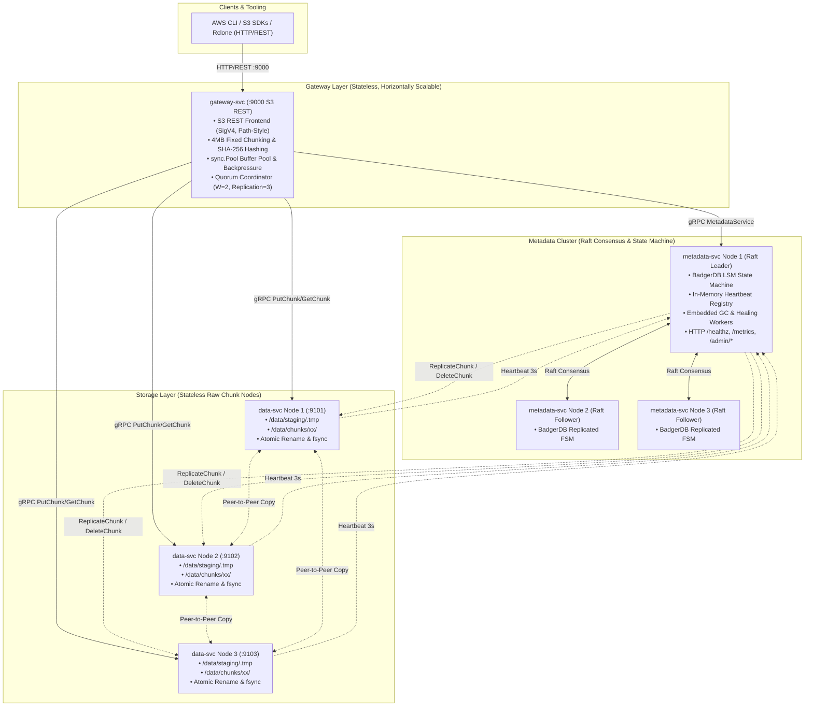
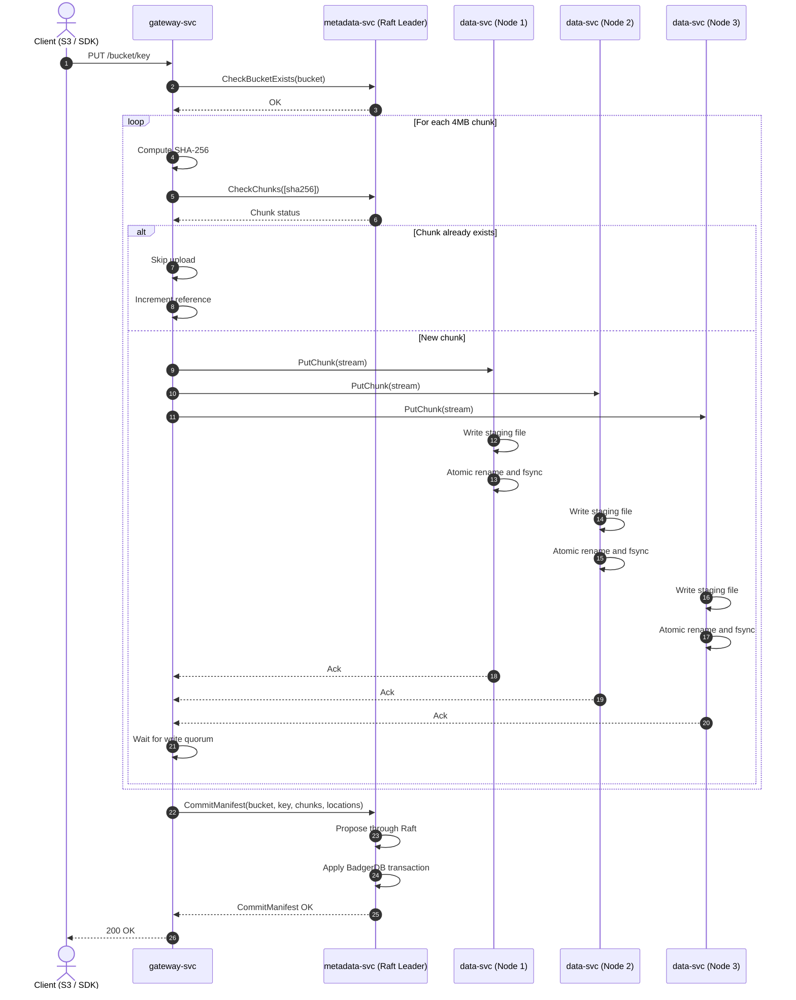
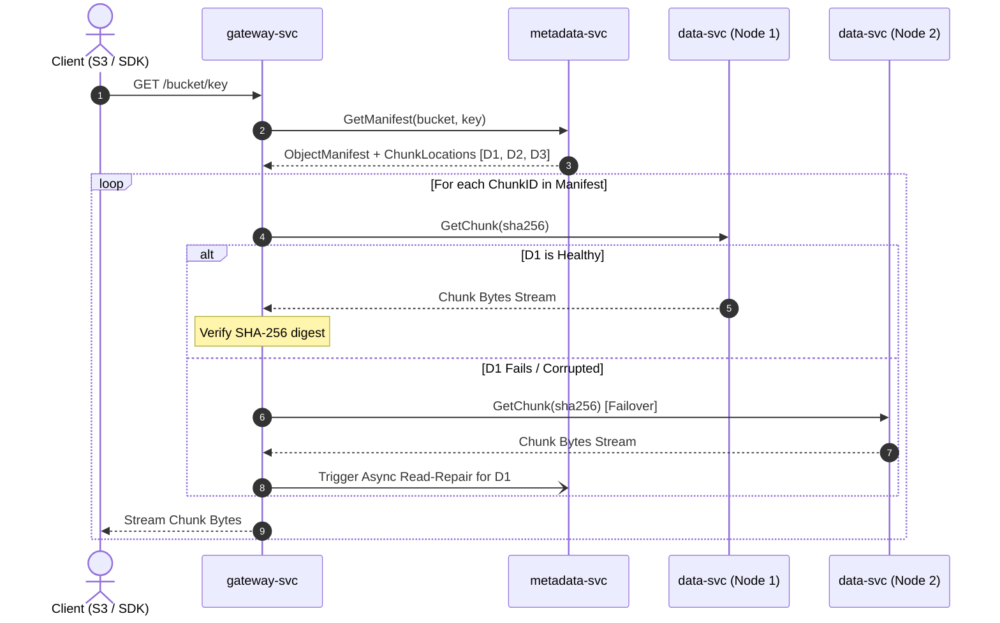
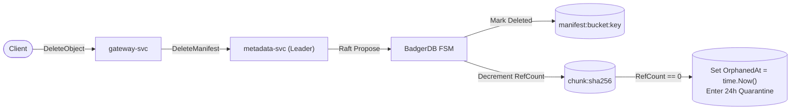

# Castor — Architecture & System Diagrams

This document outlines the architecture, end-to-end data flows, and operational lifecycle workflows of Castor.

---

## 1. High-Level System Architecture

Castor consists of three primary service layers:
- **`gateway-svc`**: Stateless front door exposing an S3-compatible HTTP/REST API (`:9000`). Handles in-memory 4MB chunking, streaming deduplication checks, and quorum placement coordination.
- **`metadata-svc`**: 3-node Raft consensus cluster (`:9091`-`:9093`) backed by BadgerDB. Manages buckets, manifests, chunk locations, an in-memory dynamic node registry, leader-only background workers, and administrative HTTP endpoints (`/healthz`, `/metrics`, `/admin/*`).
- **`data-svc`**: Stateless, content-addressed storage nodes (`:9101`-`:9103`) storing raw chunks directly on local filesystems with two-character prefix sharding (`/data/chunks/xx/<sha256>`).



---

## 2. Data Flow Diagrams

### 2.1. Write Path (PUT Flow)
1. **Ingest & Chunking**: `gateway-svc` accepts the stream, buffers it disklessly into 4MB memory chunks (`sync.Pool`), and hashes each chunk with SHA-256.
2. **Deduplication Check**: Queries `metadata-svc.CheckChunks`. If a chunk exists (`RefCount > 0`), upload is bypassed.
3. **Quorum Replication (W=2/R=3)**: Streams new chunks in parallel to 3 capacity-weighted `data-svc` nodes. Each node writes to staging and promotes via atomic `os.Rename`. The write advances when majority ($W=2$) acks.
4. **Atomic Commit**: Gateway submits manifest details and chunk location mappings to the Raft leader via `CommitManifest`. BadgerDB applies the commit atomically.



### 2.2. Read Path (GET Flow)
1. `gateway-svc` retrieves the object manifest and chunk locations from `metadata-svc` (leader-routed).
2. For each ordered chunk, the gateway reads from the first responsive replica node.
3. Chunks are verified against their SHA-256 hash.
4. If a replica node is unreachable or corrupted, the gateway falls back to an alternate replica and triggers passive read-repair.



### 2.3. Delete Path Flow
1. Client calls `DeleteObject(bucket, key)`.
2. `metadata-svc` proposes `DeleteManifest` through Raft.
3. FSM marks the manifest deleted, decrements `RefCount` for all referenced chunks, and sets `OrphanedAt = time.Now()` for chunks whose `RefCount` drops to 0.
4. Chunks enter a **24-hour quarantine period** before physical disk purging.



---

## 3. Operations & Lifecycle Management Diagram

Background maintenance runs directly on the active **`metadata-svc` Raft leader**, eliminating external schedulers while preventing conflicting operations.

```mermaid
flowchart TD
    subgraph RegistryOps["1. Node Discovery & Heartbeat Registry"]
        DataNodes["data-svc Nodes [1..N]"] -->|Heartbeat every 3s<br/>(Disk Free/Total)| H_Reg["In-Memory Heartbeat Registry<br/>(Bypasses Raft log)"]
        H_Reg -->|Missed 3 heartbeats / 15s| NodeDown["Mark Node DEGRADED / OFFLINE"]
        NodeDown -->|Exclude from placement| Placement["Capacity-Aware Placement<br/>(gateway-svc queries with 5-10s TTL)"]
    end

    subgraph HealingOps["2. Active Replica Healing Worker (Leader-Only)"]
        ScanUnder["Scan BadgerDB for chunks with len(Nodes) < 3"]
        ScanUnder --> PickTarget["Pick healthy target node from Heartbeat Registry"]
        PickTarget --> InstructRep["Instruct existing replica via ReplicateChunk RPC"]
        InstructRep --> P2PCopy["Peer-to-Peer Chunk Copy<br/>(data-svc -> data-svc)"]
        P2PCopy --> ProposeUpdate["Propose UpdateChunkLocation through Raft"]
    end

    subgraph GCOps["3. Quarantine Garbage Collection Worker (Leader-Only)"]
        ScanOrphan["Scan BadgerDB for ChunkLocations with:<br/>• RefCount == 0<br/>• time.Since(OrphanedAt) > 24 Hours"]
        ScanOrphan --> RateLimit["Token Bucket Rate Limiter<br/>(e.g., 50 chunks/sec)"]
        RateLimit --> SendDelete["Send DeleteChunk RPC to holding data-svc nodes"]
        SendDelete --> PurgeDisk["data-svc removes /data/chunks/xx/<sha256>"]
        PurgeDisk --> ProposeRemove["Propose RemoveChunkLocations through Raft"]
    end

    subgraph MultipartOps["4. Abandoned Multipart Upload Cleanup (Leader-Only)"]
        ScanMP["Scan pending multipart manifests with:<br/>• Status == 'pending'<br/>• time.Since(CreatedAt) > 24 Hours"]
        ScanMP --> AbortMP["Propose AbortMultipart through Raft"]
        AbortMP --> DecrChunks["Decrement chunk RefCounts<br/>(Unreferenced chunks enter 24h quarantine)"]
    end

    subgraph StartupOps["5. Local Storage Self-Healing (data-svc Startup)"]
        ServiceStart["data-svc startup"] --> SweepStaging["Sweep /data/staging/ directory"]
        SweepStaging --> DeleteTmp["Delete orphaned *.tmp files from ungraceful crashes"]
    end
```

---

## 4. Architectural Guarantees & Boundaries

| Subsystem | Primary Mechanism | Guarantees & Semantics |
|---|---|---|
| **Metadata Consistency** | `hashicorp/raft` + BadgerDB | Linearizable writes; atomic multi-entity commits (`CommitManifest`); leader-routed reads. |
| **Data Placement & Quorum** | Majority Quorum ($W=2$, $R=3$) | Writes acknowledge as soon as 2 nodes persist; 3rd replica healed asynchronously. |
| **Data Integrity** | SHA-256 Content-Addressing | Chunks verified on ingress, atomic disk promotion, and verified on read. |
| **Crash Consistency** | Staging + POSIX `os.Rename` | Zero torn chunk writes on disk; staged files cleaned up on restart. |
| **Garbage Collection Safety** | 24-Hour Quarantine Window | Protects concurrent deduplicating writes from race conditions with chunk deletion. |
| **Operational Simplicity** | Embedded Leader Workers | No external orchestrators or cron daemons; workers automatically pause/resume upon Raft leadership changes. |
