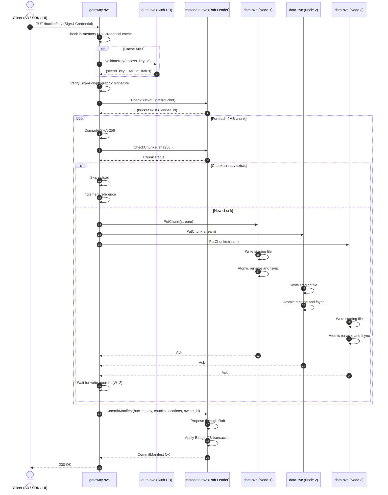
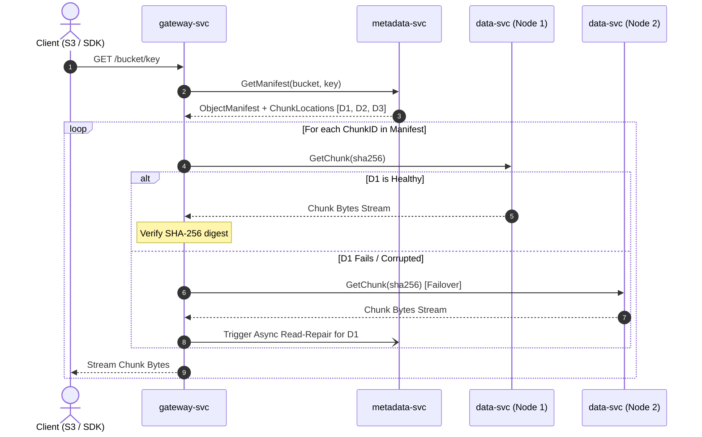
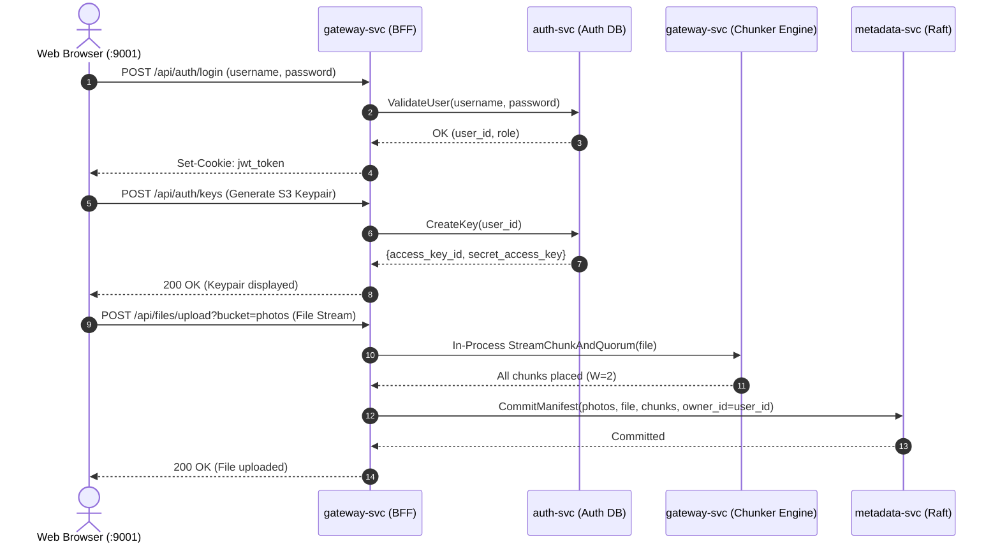

# Castor — Architecture & System Diagrams

This document outlines the architecture, end-to-end data flows, and operational lifecycle workflows of Castor.

---

## 1. High-Level System Architecture

Castor consists of four primary service layers across the data and control planes:
- **`gateway-svc`**: Stateless front door exposing:
  - **S3 REST API (`:9000`)**: Embedded `versitygw` with dynamic SigV4 validation, in-memory 4MB chunking (`sync.Pool`), streaming deduplication checks, and quorum placement coordination.
  - **Embedded Web Console & BFF (`:9001`)**: Go `embed.FS` serving an AI-generated UI, JWT session endpoints, and an in-process bridge for browser file operations.
- **`auth-svc`**: Identity and credential provider (`:9095`) backed by a relational database (PostgreSQL or SQLite). Manages users, password hashing (`bcrypt`), and S3 `(access_key, secret_key)` keypairs with internal validation RPCs.
- **`metadata-svc`**: 3-node Raft consensus cluster (`:9091`-`:9093`) backed by BadgerDB. Manages buckets, manifests (with `owner_id` user attribution), chunk locations, an in-memory dynamic node registry, leader-only background workers, and administrative HTTP endpoints (`/healthz`, `/metrics`, `/admin/*`).
- **`data-svc`**: Stateless, content-addressed storage nodes (`:9101`-`:9103`) storing raw chunks directly on local filesystems with two-character prefix sharding (`/data/chunks/xx/<sha256>`). Agnostic to users and auth.

```mermaid
flowchart TD
    subgraph Clients["Clients & Tooling"]
        S3Client["AWS CLI / S3 SDKs / Rclone (HTTP S3 :9000)"]
        WebUser["Web Browser Console (HTTP :9001)"]
    end

    subgraph GatewayLayer["Gateway Layer (gateway-svc, Stateless, Horizontally Scalable)"]
        direction TB
        GW_S3["Port :9000: S3 REST Frontend<br/>• versitygw (SigV4, Path-Style)<br/>• 4MB Fixed Chunking & SHA-256 Hashing<br/>• sync.Pool Buffer Pool & Backpressure<br/>• Quorum Coordinator (W=2, Replication=3)<br/>• In-Memory Credential Cache (30s TTL)"]
        GW_UI["Port :9001: Web Console & BFF (embed.FS)<br/>• Serves Static Dashboard Assets<br/>• Browser JSON API (/api/*)<br/>• In-Process Upload Bridge"]
    end

    subgraph ControlPlane["Control Plane (auth-svc :9095)"]
        AuthSvc["auth-svc (:9095)"]
        AuthDB[("Auth DB (PostgreSQL / SQLite)<br/>• users (id, email, password_hash)<br/>• s3_credentials (access_key, secret_key)")]
        AuthSvc --- AuthDB
    end

    subgraph MetadataLayer["Metadata Cluster (Raft Consensus & State Machine)"]
        direction TB
        M_Leader["metadata-svc Node 1 (Raft Leader)<br/>• BadgerDB LSM State Machine<br/>• In-Memory Heartbeat Registry<br/>• Embedded GC & Healing Workers<br/>• HTTP /healthz, /metrics, /admin/*"]
        M_Follower1["metadata-svc Node 2 (Raft Follower)<br/>• BadgerDB Replicated FSM"]
        M_Follower2["metadata-svc Node 3 (Raft Follower)<br/>• BadgerDB Replicated FSM"]

        M_Leader <-->|Raft Consensus| M_Follower1
        M_Leader <-->|Raft Consensus| M_Follower2
    end

    subgraph DataLayer["Storage Layer (Stateless Raw Chunk Nodes)"]
        direction LR
        D1["data-svc Node 1 (:9101)<br/>• /data/staging/<uuid>.tmp<br/>• /data/chunks/xx/<sha256><br/>• Atomic Rename & fsync"]
        D2["data-svc Node 2 (:9102)<br/>• /data/staging/<uuid>.tmp<br/>• /data/chunks/xx/<sha256><br/>• Atomic Rename & fsync"]
        D3["data-svc Node 3 (:9103)<br/>• /data/staging/<uuid>.tmp<br/>• /data/chunks/xx/<sha256><br/>• Atomic Rename & fsync"]
    end

    %% Client connections
    S3Client -->|HTTP/REST :9000| GW_S3
    WebUser -->|HTTP/REST :9001| GW_UI

    %% Gateway to Auth
    GW_S3 -.->|Validate Key (Cache Miss)| AuthSvc
    GW_UI -->|Auth & Key Management| AuthSvc

    %% Gateway to backend
    GW_S3 -->|gRPC MetadataService| M_Leader
    GW_S3 -->|gRPC PutChunk/GetChunk| D1
    GW_S3 -->|gRPC PutChunk/GetChunk| D2
    GW_S3 -->|gRPC PutChunk/GetChunk| D3
    GW_UI -.->|Cluster Health :9071| M_Leader

    %% Background interactions
    D1 -.->|Heartbeat 3s| M_Leader
    D2 -.->|Heartbeat 3s| M_Leader
    D3 -.->|Heartbeat 3s| M_Leader

    M_Leader -.->|ReplicateChunk / DeleteChunk| D1
    M_Leader -.->|ReplicateChunk / DeleteChunk| D2
    M_Leader -.->|ReplicateChunk / DeleteChunk| D3
    D1 <..->|Peer-to-Peer Copy| D2
    D2 <..->|Peer-to-Peer Copy| D3
    D1 <..->|Peer-to-Peer Copy| D3
```

---

## 2. Data Flow Diagrams

### 2.1. Write Path (PUT Flow)
1. **Authentication & Ingress**: `gateway-svc` receives `PUT /bucket/key` on port `:9000`. The embedded `versitygw` engine verifies AWS SigV4 credentials. It checks its in-memory LRU credential cache (30s TTL); on a cache miss, it queries `auth-svc.ValidateKey(access_key_id)`.
2. **Bucket Verification & Ownership**: `gateway-svc` verifies bucket existence and ownership via `metadata-svc.CheckBucketExists(bucket)`.
3. **Ingest & Chunking**: `gateway-svc` buffers the payload disklessly into 4MB memory chunks (`sync.Pool`) and hashes each chunk with SHA-256.
4. **Deduplication Check**: Queries `metadata-svc.CheckChunks`. If a chunk exists (`RefCount > 0`), upload is bypassed.
5. **Quorum Replication (W=2/R=3)**: Streams new chunks in parallel to 3 capacity-weighted `data-svc` nodes. Each node writes to staging and promotes via atomic `os.Rename`. The write advances when majority ($W=2$) acks.
6. **Atomic Commit with Attribution**: Gateway submits manifest details, chunk location mappings, and `owner_id` to the Raft leader via `CommitManifest`. BadgerDB applies the commit atomically.



### 2.2. Read Path (GET Flow)
1. `gateway-svc` retrieves the object manifest and chunk locations from `metadata-svc` (leader-routed).
2. For each ordered chunk, the gateway reads from the first responsive replica node.
3. Chunks are verified against their SHA-256 hash.
4. If a replica node is unreachable or corrupted, the gateway falls back to an alternate replica and triggers passive read-repair.



### 2.3. Delete Path Flow
1. Client calls `DeleteObject(bucket, key)`.
2. `metadata-svc` proposes `DeleteManifest` through Raft.
3. FSM marks the manifest deleted, decrements `RefCount` for all referenced chunks, and sets `OrphanedAt = time.Now()` for chunks whose `RefCount` drops to 0.
4. Chunks enter a **24-hour quarantine period** before physical disk purging.


### 2.4. Control Plane & Console Flow
1. **User Authentication (Web Console :9001)**:
   - User submits username/password to `POST /api/auth/login`.
   - `gateway-svc` queries `auth-svc`, which validates credentials against the PostgreSQL/SQLite Auth DB (`bcrypt.CompareHashAndPassword`).
   - A signed JWT session cookie is returned to the browser.
2. **S3 Access Key Lifecycle**:
   - User generates S3 API credentials via `POST /api/auth/keys`.
   - `auth-svc` creates a cryptographically random `(access_key_id, secret_access_key)` pair and persists it in `s3_credentials`.
   - The user uses these keys with standard tooling (`aws-cli`, `boto3`, `rclone`) against port `:9000`.
3. **In-Process Web Upload Bridge**:
   - Browser uploads files via multipart form to `POST /api/files/upload?bucket=my-bucket`.
   - `gateway-svc` verifies the browser's JWT session, then streams bytes directly into its internal 4MB chunking and placement pipeline (in-process Go function call, zero double-hop network latency).
   - Gateway commits the manifest to Raft with `owner_id = session.user_id`.



---

## 3. Operations & Lifecycle Management Diagram

Background maintenance runs directly on the active **`metadata-svc` Raft leader**, eliminating external schedulers while preventing conflicting operations.

```mermaid
flowchart TD
    subgraph RegistryOps["1. Node Discovery & Heartbeat Registry"]
        DataNodes["data-svc Nodes [1..N]"] -->|Heartbeat every 3s<br/>(Disk Free/Total)| H_Reg["In-Memory Heartbeat Registry<br/>(Bypasses Raft log)"]
        H_Reg -->|Missed 3 heartbeats / 15s| NodeDown["Mark Node DEGRADED / OFFLINE"]
        NodeDown -->|Exclude from placement| Placement["Capacity-Aware Placement<br/>(gateway-svc queries with 5-10s TTL)"]
    end

    subgraph HealingOps["2. Active Replica Healing Worker (Leader-Only)"]
        ScanUnder["Scan BadgerDB for chunks with len(Nodes) < 3"]
        ScanUnder --> PickTarget["Pick healthy target node from Heartbeat Registry"]
        PickTarget --> InstructRep["Instruct existing replica via ReplicateChunk RPC"]
        InstructRep --> P2PCopy["Peer-to-Peer Chunk Copy<br/>(data-svc -> data-svc)"]
        P2PCopy --> ProposeUpdate["Propose UpdateChunkLocation through Raft"]
    end

    subgraph GCOps["3. Quarantine Garbage Collection Worker (Leader-Only)"]
        ScanOrphan["Scan BadgerDB for ChunkLocations with:<br/>• RefCount == 0<br/>• time.Since(OrphanedAt) > 24 Hours"]
        ScanOrphan --> RateLimit["Token Bucket Rate Limiter<br/>(e.g., 50 chunks/sec)"]
        RateLimit --> SendDelete["Send DeleteChunk RPC to holding data-svc nodes"]
        SendDelete --> PurgeDisk["data-svc removes /data/chunks/xx/<sha256>"]
        PurgeDisk --> ProposeRemove["Propose RemoveChunkLocations through Raft"]
    end

    subgraph MultipartOps["4. Abandoned Multipart Upload Cleanup (Leader-Only)"]
        ScanMP["Scan pending multipart manifests with:<br/>• Status == 'pending'<br/>• time.Since(CreatedAt) > 24 Hours"]
        ScanMP --> AbortMP["Propose AbortMultipart through Raft"]
        AbortMP --> DecrChunks["Decrement chunk RefCounts<br/>(Unreferenced chunks enter 24h quarantine)"]
    end

    subgraph StartupOps["5. Local Storage Self-Healing (data-svc Startup)"]
        ServiceStart["data-svc startup"] --> SweepStaging["Sweep /data/staging/ directory"]
        SweepStaging --> DeleteTmp["Delete orphaned *.tmp files from ungraceful crashes"]
    end
```

---

## 4. Architectural Guarantees & Boundaries

| Subsystem | Primary Mechanism | Guarantees & Semantics |
|---|---|---|
| **Identity & Authentication** | PostgreSQL / SQLite + In-Memory LRU Cache | ACID user & credential management; in-memory caching (30s TTL) protects DB from S3 streaming request spikes. |
| **Separation of Concerns** | Single Source of Truth | Auth DB owns Identity; Raft owns Storage State. Zero distributed 2PC dual-write anomalies. |
| **Metadata Consistency** | `hashicorp/raft` + BadgerDB | Linearizable writes; atomic multi-entity commits (`CommitManifest`); leader-routed reads. |
| **Data Placement & Quorum** | Majority Quorum ($W=2$, $R=3$) | Writes acknowledge as soon as 2 nodes persist; 3rd replica healed asynchronously. |
| **Data Integrity** | SHA-256 Content-Addressing | Chunks verified on ingress, atomic disk promotion, and verified on read. |
| **Crash Consistency** | Staging + POSIX `os.Rename` | Zero torn chunk writes on disk; staged files cleaned up on restart. |
| **Garbage Collection Safety** | 24-Hour Quarantine Window | Protects concurrent deduplicating writes from race conditions with chunk deletion. |
| **Operational Simplicity** | Embedded Leader Workers & Single Binary Console | No external orchestrators; console runs in-process inside `gateway-svc` on port `:9001`. |
